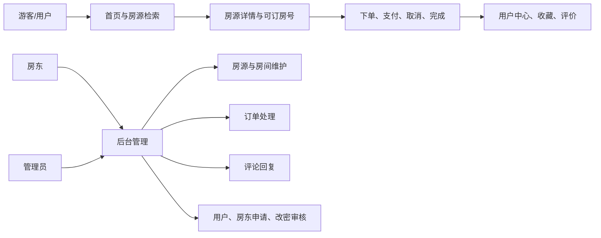
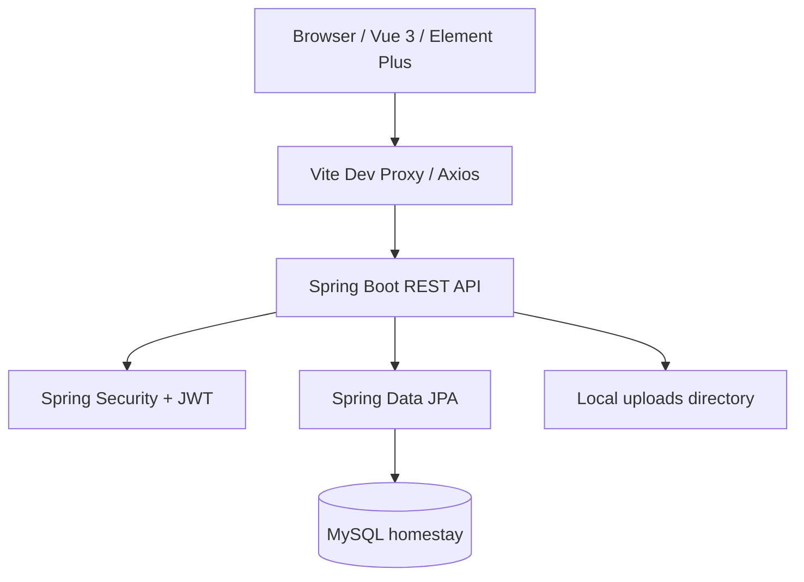
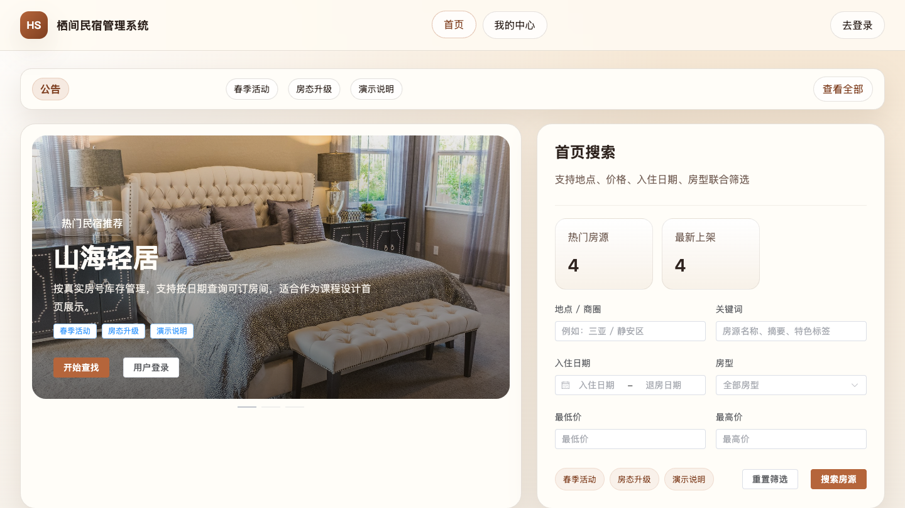
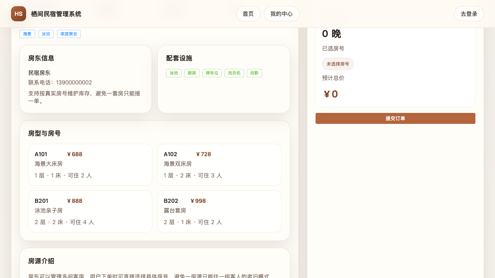
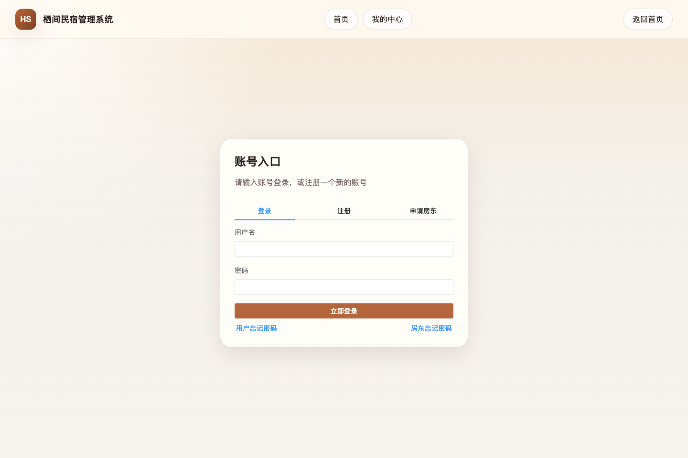
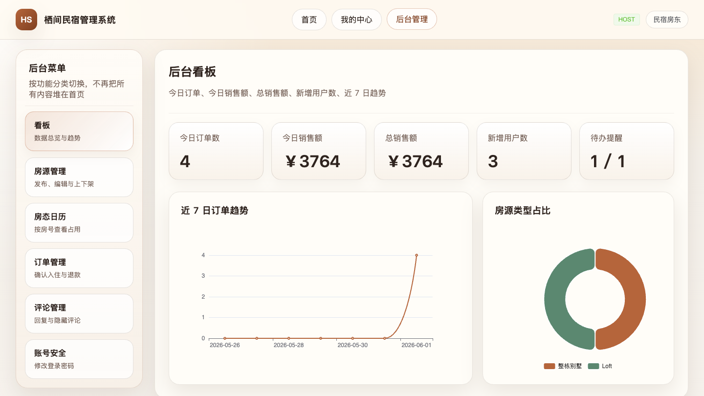
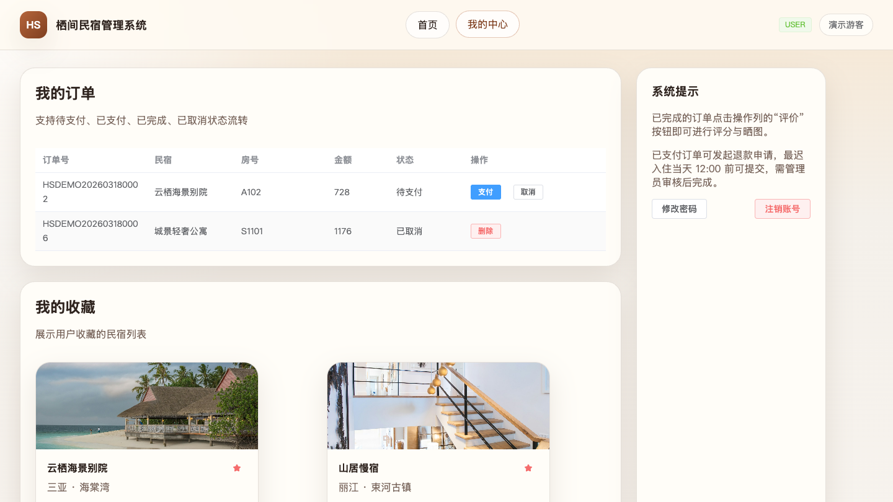
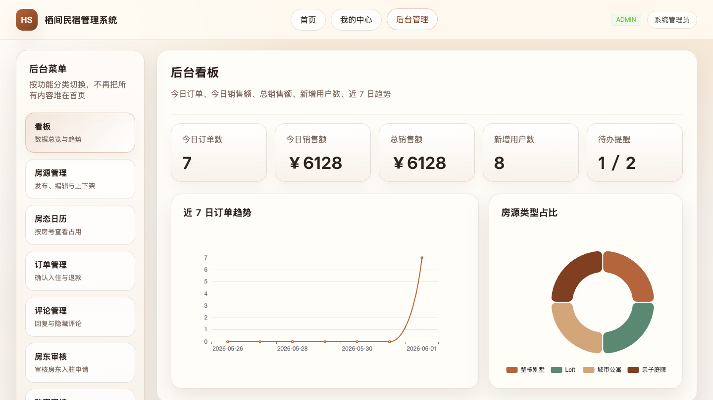

# 栖间民宿管理系统

<!-- open-source-intro-start -->
> **作者寄语**
> 
> 主包是 02 年的，15 岁开始学习计算机，17 岁入行。虽然没有上过大学，但已经帮助很多人顺利毕业和就业。开源这些项目，希望能帮助到你们，也顺便推荐我的论文 AI 工具。如果对主包感兴趣，可以在抖音搜索：迷人闹；如果想学习 AI 编程或需要辅导，也可以联系主包。
> 
> **论文/毕设画图工具推荐：** [毕业论文画图助手](https://gitee.com/chenmin_1_2857135639/bishelunwen) 支持架构图、流程图、ER 图、业务流程图等，适合配合本项目完成论文和答辩材料。
<!-- open-source-intro-end -->

<!-- third-party-api-start -->
## 第三方 API 配置说明

### 高德地图 JavaScript API

- 用途：用于后台地图选点、民宿/地址坐标拾取与地图展示。
- 官方文档：<https://lbs.amap.com/api/javascript-api-v2/summary>
- Key 申请页：<https://console.amap.com/dev/key/app>
- 获取方式：登录高德开放平台，创建应用，添加 Web 端（JS API）Key，并在安全设置中获取或配置安全密钥 `securityJsCode`。
- 环境变量：`VITE_AMAP_KEY=your_amap_js_key`，`VITE_AMAP_SECURITY_JS_CODE=your_security_js_code`。

> 注意：不要把真实 API Key、Secret、Token 提交到代码仓库。开源示例只保留占位值，本地运行时再写入 `.env` 或系统环境变量。
<!-- third-party-api-end -->


栖间民宿管理系统是一个前后端分离的民宿预订与运营管理项目，后端使用 Spring Boot + Spring Data JPA，前端使用 Vue 3 + Vite + Element Plus。项目重点演示“民宿下有多个真实房间”的库存模型，用户下单时可以按入住日期查询可订房号，避免传统课程设计里“一套民宿被一个订单锁死”的简化问题。

## 演示视频

[观看项目演示视频](docs/video/homestay-demo.mp4)

演示视频从统一登录入口开始，依次说明游客/用户、房东、管理员三个角色，再展示各角色的核心操作页面。

## 相关项目推荐

写毕业论文时，经常还需要画系统架构图、流程图、ER 图、业务流程图。可以配合这个画图助手使用：

**毕业论文画图助手：** [查看项目](https://gitee.com/chenmin_1_2857135639/bishelunwen)

这个民宿管理系统适合作为业务系统主体，画图助手适合辅助完成论文中的系统设计图、流程图和结构图，两者搭配更方便做毕业设计材料整理。

## 功能模块



## 系统架构



## 截图

| 首页 | 房源详情 |
| --- | --- |
|  |  |

| 登录 | 房东后台 |
| --- | --- |
|  |  |

| 用户中心 | 管理员后台 |
| --- | --- |
|  |  |

## 技术栈

- 后端：Spring Boot 2.7.18、Spring Security、Spring Data JPA、MySQL、JWT
- 前端：Vue 3、Vite、Pinia、Vue Router、Element Plus、Axios、ECharts
- 演示视频：Remotion

## 核心能力

- 注册登录、JWT 鉴权、角色路由
- 首页公告、Banner、热门/最新/推荐房源
- 房源分页搜索、详情展示、收藏
- 按入住/退房日期查询可订房号
- 多房间订单、模拟支付、取消、退款申请、完成
- 用户中心：资料、订单、收藏、评价、密码维护
- 房东/管理员后台：看板、房源发布、房间维护、订单管理、评论回复
- 管理员审核：房东申请、找回密码、用户启禁用、黑名单
- 订单 CSV 导出
- 演示数据自动初始化

## 本地启动

### 1. 准备数据库

默认使用本机 MySQL：

- Host：`localhost:3306`
- DB：`homestay`
- User：`root`
- Password：`root`

```bash
mysql -uroot -proot -e "CREATE DATABASE IF NOT EXISTS homestay DEFAULT CHARACTER SET utf8mb4 COLLATE utf8mb4_unicode_ci;"
mysql -uroot -proot homestay < springboot/src/main/resources/sql/homestay.sql
```

也可以复制 `.env.example` 并通过环境变量覆盖数据库和 JWT 配置。

### 2. 启动后端

```bash
cd springboot
./mvnw spring-boot:run
```

默认后端地址：`http://localhost:8082`

如果端口被占用：

```bash
SERVER_PORT=8083 ./mvnw spring-boot:run
```

### 3. 启动前端

```bash
cd vue
npm install --legacy-peer-deps
npm run dev
```

默认前端地址：`http://localhost:5173`

如果后端临时跑在 `8083`：

```bash
VITE_API_TARGET=http://localhost:8083 npm run dev -- --port 5174
```

## 演示账号

| 角色 | 用户名 | 密码 |
| --- | --- | --- |
| 管理员 | `admin` | `admin123` |
| 房东 | `host` | `host123` |
| 房东 | `host2` | `host123` |
| 游客 | `user` | `user123` |
| 游客 | `user2` | `user123` |
| 游客 | `user3` | `user123` |

## 测试与发布检查

```bash
# 后端测试
cd springboot
./mvnw test

# 前端构建
cd ../vue
npm run build

# 本地烟测，按实际端口覆盖
cd ..
API_BASE=http://localhost:8083 WEB_BASE=http://localhost:5174 ./scripts/smoke-test.sh
```

## 演示视频生成

```bash
cd demo-video
npm install
npm run render
```

输出文件：

- `docs/video/homestay-demo.mp4`

视频场景和字幕由以下 JSON 驱动，便于继续改文案：

- `demo-video/src/full-demo-scenes.json`
- `demo-video/src/full-demo-captions.json`

## 开源与安全说明

- 本项目使用 MIT License。
- 默认数据库密码和 JWT secret 只适合本地演示，部署前请用环境变量替换。
- 不要提交 `.env`、真实数据库备份、上传文件、访问 token 或生产日志。
- 项目没有接入第三方 AI 服务；如后续扩展 AI 能力，请把 API Key 放入环境变量或密钥管理服务。
